# Furuta Pendulum — Project Presentation (5–6 slides)

---

## Slide 1 — What we built + demo goal

- **System:** Furuta pendulum (rotary inverted pendulum) with 2 DOF
  - Arm angle $\theta$ driven by a stepper (open-loop steps)
  - Pendulum angle $\phi$ measured by AS5600 magnetic encoder
- **Objective:** keep the pendulum upright ($\phi \approx 0$) by commanding arm angular acceleration $\ddot{\theta}$
- **Why it’s interesting:** unstable equilibrium + tight timing + actuator limits
- **Demo plan:** show balancing near upright, then disturbances and recovery behavior

---

## Slide 2 — Physics (linearized model near upright)

- Full Furuta dynamics are nonlinear and coupled; we control **near upright** using small-angle linearization
- Linearized pendulum equation (control input $u = \ddot{\theta}$):

$$I_p \ddot{\phi} = m g \frac{L}{2}\,\phi - m \frac{L}{2} r\, \ddot{\theta}$$

- With $I_p = \frac{1}{3} m L^2$ (thin rod about one end):

$$\ddot{\phi} = \omega_n^2\,\phi - B\,u$$

- Key “speed requirement” numbers for our build:
  - $\omega_n = \sqrt{\frac{3g}{2L}} \approx 11.57\ \text{rad/s}$ ($\approx 1.84\ \text{Hz}$)
  - Instability time constant $\tau = 1/\omega_n \approx 86\ \text{ms}$
  - Example fall time (3° → 20°): $t_{fall} \approx 224\ \text{ms}$
- **Takeaway:** the control loop needs to be **fast** and **low-latency**

---

## Slide 3 — Control design (PD via pole placement)

- We use **PD** (not PID): an integrator tends to wind up and destabilize an inverted pendulum
- Plant (from Slide 2):

$$\ddot{\phi} = \omega_n^2\,\phi - B\,u$$

- PD law:

$$u_{pd} = K_p\phi + K_d\dot{\phi}$$

- Closed-loop characteristic form:

$$\ddot{\phi} + B K_d \dot{\phi} + (B K_p - \omega_n^2)\phi = 0$$

- Choose desired closed-loop $\omega_c$ and damping $\zeta$ (typically $\zeta\approx 0.7$), then gains follow:

$$K_p = \frac{\omega_c^2 + \omega_n^2}{B},\qquad K_d = \frac{2\zeta\omega_c}{B}$$

- Practical implementation details:
  - $\dot{\phi}$ from encoder using an $N$-point difference + EMA smoothing
  - Add a **soft arm-centering term** to avoid drifting into cable wrap

---

## Slide 4 — Constraints + safety (what we must not violate)

- **Cable wrap limit (hard):** arm travel limited to about **±60°**
  - Soft zone around **±50°** where centering ramps up
  - Hard stop triggers motor disable / safe state
- **Linearization validity (hard):** controller is only “guaranteed” near upright
  - Enforced cutoff around **$|\phi| \gtrsim 15°$** → motor off / waiting for manual reset
- **Stepper limits (hard):** open-loop stepper can lose steps silently if over-driven
  - Stay within empirically safe step rate and step acceleration
- **Why we enforce this:** protect wiring + avoid untracked arm position + keep behavior predictable during demos

---

## Slide 5 — Hardware setup (what’s in the stack)

- **Compute + sensing:** Raspberry Pi Pico (MicroPython) + AS5600 (12-bit, I²C)
- **Actuation:** NEMA17 stepper + A4988 driver (microstepping)
- **Critical build points:**
  - A4988 **current calibration** via $V_{ref} = I_{limit}\cdot 8\cdot R_s$ (done before motor connection)
  - 100 µF capacitor across VMOT/GND (driver protection)
  - Correct AS5600 magnet placement (gap + centering)
  - Common ground across PSU, driver, Pico, sensor
- **Why this matters:** most “control issues” in practice come from wiring, calibration, or sensor noise—not the math

---

## Slide 6 — Tuning + adding nonlinearity to the control law

- **Tuning workflow (what we actually do):**
  - Verify correct control direction (sign convention)
  - Increase $K_p$ until oscillation, then back off
  - Increase $K_d$ for damping; adjust velocity smoothing to avoid chatter
  - Tune centering so it returns to center **without** fighting balance
- **Why add a nonlinearity:** the linear PD assumes small angles, but the real system has
  - encoder quantization + velocity noise (derivative injection)
  - step quantization / deadband
  - growing model error as $|\phi|$ increases
- **Nonlinear modification we tried (log “gain scheduling”):** scale the controller by a smooth function of angle magnitude
  - Full scaling (see firmware variant):

$$u_{nl} = u_{pd}\,\log\!\left(1 + \frac{|\phi|}{k_1}\right),\quad u_{pd}=K_p\phi + K_d\dot{\phi}$$

  - P-only scaling (alternate variant):

$$u_{nl} = \big(K_p\phi\big)\log\!\left(1 + \frac{|\phi|}{k_1}\right) + K_d\dot{\phi}$$

- **Intuition:** reduce overly aggressive corrections near $\phi\approx 0$ (less chatter), while still increasing authority as the angle grows
- **Demo note:** we’ll show both linear and nonlinear behavior side-by-side (same hardware, different controller file)

---

## Firmware state machine (Mermaid)

```mermaid
stateDiagram-v2
  [*] --> IDLE

  IDLE: motor disabled
  ACTIVE: PD control running
  RECOVERING: motor disabled; wait for manual reset
  LIMIT_HIT: unwind arm back to 0°
  FAULT: motor disabled

  IDLE --> ACTIVE: |\u03c6| < PHI_ACTIVE (\u224830\u00b0) for 500 ms
  ACTIVE --> RECOVERING: |\u03c6| > PHI_CUTOFF (\u224875\u00b0)
  ACTIVE --> LIMIT_HIT: |\u03b8| > THETA_HARD (\u2248120\u00b0)

  RECOVERING --> ACTIVE: |\u03c6| < PHI_ACTIVE (\u224830\u00b0) for 500 ms

  LIMIT_HIT --> RECOVERING: |\u03b8| \u2264 THETA_ZERO_TOL (\u22482\u00b0)

  IDLE --> FAULT: I\u00b2C read error
  ACTIVE --> FAULT: I\u00b2C read error
  RECOVERING --> FAULT: I\u00b2C read error
  LIMIT_HIT --> FAULT: I\u00b2C read error

  FAULT --> [*]
```

